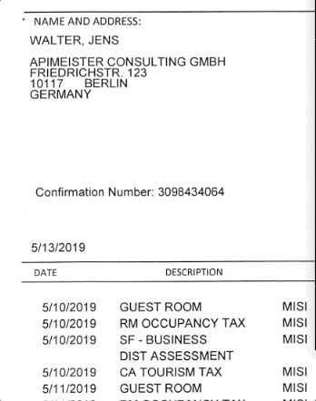

# Changelog

### \[2.23.0] - 2023-04-10

*   Changed the way annotations are selected. Now, left-clicking on an annotation selects it.

    
* NER annotations can now be edited in length after being created. 
* Enabled creating and selecting group relations on NER labeling tasks. 
* Annotations on image labeling tasks can now be selected as a group with shift-clicking.
* Polygons and polylines can now be dragged in their entirety. 
* Plugin developers can now show users longer text plugin descriptions formatted in rich text, in a new field called "Details". This field is shown to users when they open the plugin.
* Attachment information is now included in exports.

### \[2.22.0] - 2023-03-13

*   Improved performance of project dashboards by adding caching and on-demand retrieval of data

    
*   Added more granular options when re-queuing a task

    
*   Added the ability to upload [multi-image labeling tasks](https://docs.ango.ai/data/importing-assets/importing-multiple-images-as-one-multi-page-asset)

    
* Improved the performance of the PDF editor
* Improved the performance of the video editor
* Added support for the .webm, .mov, and .ogg file formats for video assets.
* Added support for more codecs for the .mp4 format for video assets.

Fixes:

* Fixed a bug where frame-specific classifications would not appear in the export
* Fixed a bug where OCR contents would not appear in the export

### \[2.21.0] - 2023-02-21

* Various improvements to the Brush, Bucket, and ROI tools.
*   Project ontologies can now be edited and [copy-pasted](https://docs.ango.ai/how-to/transfer-project-ontologies-between-projects) between projects through [a new JSON format](https://docs.ango.ai/labeling/managing-the-project-ontology#managing-classes-through-json).

    
* Legacy built-in plugins have been deprecated. The [Smart Scissors](https://docs.ango.ai/labeling/smart-scissors) tool has been moved to the core editor function.
*   Comma-separated lists of emails can now be pasted in email fields for quick bulk invitation.

    
* Added support for group relations containing a single item.

### \[2.20.0] - 2023-02-08

*   Added a new [Plugin Sessions view](https://docs.ango.ai/plugins/monitoring-plugin-progress), allowing you to check the status of background jobs.

    
* There are now different model plugin types for single assets and [batches](https://docs.ango.ai/plugins/plugin-developer-documentation/batch-model-plugins).
*   A Custom JSON field has been added to plugins, allowing you to pass custom data to plugins.

    
*   External IDs of assets can now be quickly copied to the clipboard from the asset list by [hovering over them](https://docs.ango.ai/core-concepts/assets#external-id) and clicking on the copy button.

    
* The price estimator has been deprecated.
* [You can now toggle](https://docs.ango.ai/data/importing-and-exporting-annotations/exporting-annotations#asset-toggles) whether you'd like to receive PDF Tool image information in your exports.

Fixes

* A bug preventing nested group relations from being correctly validated has been fixed.

### \[2.19.0] - 2023-01-24

Features

*   The rich text editor has been improved.

    
*   The left sidebar can now be resized.

    
*   Annotations can now be [validated programmatically](https://docs.ango.ai/core-concepts/label-validation) with custom JavaScript functions.

    
* Classifications can now be [locked](https://docs.ango.ai/data/importing-and-exporting-annotations/importing-annotations/ango-hub-import-format#lock) so that annotators cannot change them.
* Markdown files can now be [imported in bulk with JSONs](https://docs.ango.ai/data/importing-assets/bulk-importing-markdown-assets)
* Added the ability to embed files from private buckets to attachments and Markdown files.
* Added an "accepted" trigger to webhooks.

### \[2.18.1] - 2023-01-09

Features

* Added support for rich text in text classification. Toggle the switch over text classifications to switch between plain text and rich text mode.
* Added support for OCR'ing multiple selected PDF areas. Shift-click on a number of PDF areas, then right-click to perform OCR on all of them.
* Tree classification export shows the parents as well.
* Beta: Model plugin now supports classifications.

Fixes

* Fixed a bug which prevented removing a custom plugin from an organization.
* Fixed a bug which prevented reviewer information from appearing in the performance export

### \[2.18.0] - 2023-01-03

Features

* Updated the "[Task Info](labeling/labeling-editor-interface/#right-hand-side)" panel to show Asset IDs and other information about the task currently being viewed.

<figure><figcaption></figcaption></figure>

* Added support for nested classifications for relation objects in PDF. You may now create a relation between two or more PDF area tools, then relate that relation to another annotation or relation present on the PDF.

<figure><figcaption></figcaption></figure>

* Changed background of nested classifications for easier recognition of nested levels.
* Added [Tree Dropdown classification tool](labeling/labeling-tools/classification-tools/tree-dropdown.md).

<figure><figcaption></figcaption></figure>

* Added OCR to context menu (right-click menu) for [PDF area](labeling/labeling-tools/pdf-tool.md) annotations. Right click on a PDF annotation, click on the "OCR" button and the OCR results will be visualized and added within the label.

<figure><figcaption></figcaption></figure>

* Updated the visual representation of [group relations](data/ango-export-format/relations.md) for PDF area labels.
* Updated the way PDF areas are visualized and selected. You now need to double click to select PDF areas.
* Added new [audio playback](labeling/labeling-editor-interface/audio-labeling-editor.md) features: selectable play speed and FWD-REW buttons.
* Added link to our documentation in the "Help" dialog.

<figure><figcaption></figcaption></figure>

Fixes

* Fixed a bug where filters were not returning correct results in the "Assets" and "Tasks" lists.
* Fixed a bug where rarely the number of issues and the labeling duration of tasks were not represented correctly in the export.
* Fixed a bug where the "New Version" popup would appear multiple times.

Public Beta Updates

* Custom plugins are now available to create and try.&#x20;

### \[2.17.0] - 2022-12-05

Features

* Label import without schema id is supported.
* Brush size and distance shortcut is added (shift + wheel).
* Brush ROI feature added.

Fixes

* Category change shortcut is enabled for disabled tools.
* Organization name missing on login is fixed.
* DICOM images not centered on initial load is fixed.
* Data fetching errors related to cross-origin requests are fixed.
* Window coloring options not updating image is fixed.

### \[2.16.0] - 2022-11-22

Features

* Brush tool is available now.
* Project and organization ids are now visible on queue links.
* Project owner is added to the list on Settings -> Members.

Fixes

* Member invitation modal email not being cleared after close is fixed.
* Review config assignee filter breaking "users cannot review their own task" rule is fixed.

### \[2.15.0] - 2022-11-14

Features

* Batch Name option is added to the export configuration.
* getIntegrations & setPriority methods are added to the SDK.

Fixes

* Create Project wizard is simplified.
* Label queue conflict when all tasks are completed in a project is fixed.
* Assigning manually added label tasks to the same user from queue is fixed.

### \[2.14.0] - 2022-11-07

Features

* Classification and relation answer metadata is now available in export files.
* Imported label task data is now being applied to all the tasks of the asset.
* Organization info and Switch Organization menu is moved to the navigation bar.

### \[2.13.0] - 2022-10-31

Features

* Tool & classification based consensus scores are supported now, displayed on Project Overview -> Consensus Distribution
* Labeler filter is added to the Issues table.

### \[2.12.0] - 2022-10-26

Features

* GeoTIFF file support is added.

Fixes

* Segmentation action history (undo/redo) flow is fixed.
* Multiple select filter fields' search results are fixed.

### \[2.11.0] - 2022-10-24

Features

* Show all hidden annotations feature is added (Shift + H).
* Image smoothing configuration is added to editor config menu.
* Zoom percentage is now visible on top-left corner of the editor.
* Regex validation support is added to free text input fields.
* Batch name is added to Task Info section on the editor sidebar.

Fixes

* Tag field is renamed to Batch to avoid ambiguity.

### \[2.10.0] - 2022-10-18

Features

* Search box is added to Tools section on the left bar.
* Lock/unlock support is added for segmentation objects.
* Clone project feature is added. Can be found on the right menu of list items on Projects page.

### \[2.9.0] - 2022-10-14

Features

* Nested classification & Exists / Does Not Exist support is added for answer filters on Assets and Tasks tables

Fixes

* Polyline tool color assignment is fixed.
* Assignee name missing on issue creation is fixed.

### \[2.8.0] - 2022-10-11

Fixes

* Duration maximum resolutions are changed to hours from days.
* Instructions' display is fixed.
* Review status display issue on fast transitions is fixed.
* Table asset and task links are now opening in new tabs.
* Tasks table data URL tooltip is added.
* Invalid character on email causing crash is fixed.
* Tag field is added to export.

### \[2.7.0] - 2022-09-28

Features

* Video tasks with the default player display is supported now. If Frame Step value is set to 0 on Advanced Configs while uploading data, uploaded videos will not be divided into frames.

Fixes

* PDF copy-paste whitespace issues are fixed.
* Video classification export issues are fixed.

### \[2.6.0] - 2022-09-27

Features

* Bulk requeue of selected tasks is supported now.
* Batch feature is deprecated in favor of the tags.
* Overview & Performance tag filter is added.
* Raising tickets on system issues is supported now. Can be found on the top right, the question mark button.

Fixes

* Project member name fix on edit.
* Segmentation frame object draw is refactored.
* Missing confirmation pop-ups are added to table delete buttons.

### \[2.5.0] - 2022-09-15

Features

* Bulk assignment of selected tasks to a user is supported now.
* Plate Recognition plugin is now available.
* Task ID and External ID columns and filters are added to Tasks table.
* Polygon objects can now be converted to segmentation objects from Context Menu -> Change Type.
* Delete Instructions feature is added.

Fixes

* All organization members are now selectable on Project -> Settings -> Members -> Add Member.
* Editor drawing actions are prevented while the label is being updated.
* Project performance percentages are fixed.

### \[2.4.0] - 2022-09-07

Features

* Save Draft feature is added. Can be found on the top left of the editor. It saves the labels of the task at the moment without changing the task's status.
* Text fields are now supported as a column field for the editor table.
* Completed By and Draft filters are added to Tasks table.
* Star feature is updated for individual use, it is not common for the task anymore.
* Show All button is added to the Issues drawer on the editor.
* GCP integrations are now supported.
* Performance metrics can now be exported as CSV files.

Fixes

* Email fields are trimmed to prevent whitespaces at the start and the end of the input.
* Loading state of the Issues drawer on the editor is improved.

### \[2.3.0] - 2022-08-24

Features

* Markdown (.md) files are supported now.
* Created By filter is added for project list.
* Switch organization prompt is added when the user tries access another organization's link.
* Issue support is added to videos & multi-frame files.
* DICOM window configuration support is added with ctrl + mouse movements.
* Review filter is added for labelers.
* Issue navigation to the relevant page is added for issue list.
* Prelabeled filter is added to the tasks table.

Fixes

* Zoom reset is prevented on page navigation.
* Current tool is de-selected on page navigation.
* Table view fix on bulk delete of all items on current page.

### \[2.2.0] - 2022-07-28

Features

* Single DICOM files with multiple frames are supported now.
* Window level and width configurations are enabled. Can be found on the Editor Config Menu on the right bottom of the editor, with presets for the different body parts.

Fixes

* Right click after deleting an object from the context menu crash is fixed.
* Page navigation is removed on single frame files.

### \[2.1.0] - 2022-07-21

Features

* "Invite to Project" feature is added. Now a new member can join an organization directly as a project member. Can be found on Project -> Settings -> Members.
* Copy object id shortcut 'p' is added.
* Navigation buttons are now supported on issue editor view.
* Total number of files that are ready for upload and their progress ratio information is added on upload modal.
* Multiple selection is supported for Review field on Tasks table.
* Task assignment for a specified member of a project is supported on API.

Fixes

* Deleting relations from label set causing a crash on tasks that contains the deleted relations is fixed. Relation instances from deleted relation tools are now displayed as unknown relations.
* Text editor relation positions on page scroll is fixed.
* Segmentation tool is updated to prevent leaving unexpected small holes on rare cases.
* Issues are now displaying line breaks correctly.
* Samples tab loading state on modal close is fixed.
* Label queue redirection issue on opening another member's task on queue is fixed.
* Issues of a deleted task remain visible on issues table is fixed.

### \[2.0.0] - 2022-06-27

Features

* Object search for table columns is added.
* Assigning single or multiple objects to cells through shortcuts is enabled.
* Only instance type tools can be assigned as column fields now.
* Tools can be disabled now to prevent creation of new instances. The button can be found left to the delete icon of a tool panel header.
* Label import can be accomplished by title without schemaId field for each task.
* Unknown objects can be made transparent through the editor settings on the bottom right with "Hide Unknown Objects" checkbox. They will be hidden unless hovered with mouse.
* Group relations are now visible and removable on editor.
* NDJSON export option is added.
* Action history with ctrl(cmd)+z and ctrl(cmd)+shift+z is added.
* Classification interpolation is added for videos.
* Group hide feature is added.
* Polygon, segmentation and PDF import samples are added.
* DICOM series labeling is now available.
* 12 bit TIFFs are supported.
* Title and schema ids are now editable on Settings -> Label Set.
* Upload loading UX is improved. Now every single file loading state can be observed.
* Sorting by External ID field is added.
* Segmentation point pixel values are rounded to the closest integer values for more accurate and lightweight results.
* Single DICOM image renderer is updated to support a wider range of files.
* Segmentation start point indicator is added.
* Price Estimator is updated.
* PDF label import support is added.
* Invitation mails are improved.

Fixes

* Negative coordinate values for bounding boxes and rotated bounding boxes are prevented.
* Bounding boxes that are overflowed out of the image and PDF borders are handled with a more user-friendly UX and edge cases are handled.
* Locked objects cannot be deleted now.
* Locked objects are better highlighted on selection.
* Smart Scissors resolution settings are automated.
* Broken forgot password anchor on invitation login is fixed.
* Polygon anchor points are hidden on lock.
* Non-assigned shortcuts behaving like Escape fixed.
* PDF form inputs are removed.
* Object context menu height inconsistency on overflows fixed.
* PDF OCR feature is removed.
* Text editor issue position on page scroll is fixed.

### \[1.8.0] - 2022-03-21

Features

* Secure access to AWS with IAM credentials is provided.
* Segmentation tool added.
* Data de-identify feature added. Option can be found in Add Data -> Advanced Configs section.

### \[1.7.0] - 2022-03-02

Features

* DICOM image file support is added.
* Brightness & contrast configuration is provided.\
  It can be accessible from editor configuration button on the right bottom of the editor.

Fixes

* Performance improvements for polygon objects.

### \[1.6.0] - 2022-02-14

Features

* Lung Detector plugin is added.

Fixes

* Current organization highlight is fixed.
* Duration miscalculation on edit is fixed.
* Video interpolation stop crash is fixed.

### \[1.5.0] - 2022-02-09

Features

* Polyline tool added.
* Grouping by tool added to the object list.
* Quick tool assignment provided with tool shortcuts while using interactors.
* LDAP integration added for on-premise environments.
* Attachment upload from API enabled.

Fixes

* Batch settings edit icon added.
* Task duration reset on clicking navigation bar buttons fixed.
* Unknown object color updated.
* OCR total box count fixed.
* Audio play-pause button reset fixed.

### \[1.4.0] - 2022-01-31

Features

* FrameCut plugin added.
* Export field selection added.
* YOLO export format added.
* Optional mask field for polygons added to export configuration.
* Star filter added to the tasks table.
* Mention users with @ feature added to the issues.
* Email verification & terms and conditions agreement added on sign up.

Fixes

* Mobile UI is refactored.
* Case sensitivity removed from text searches on tables.
* User is redirected to home after organization switch.

### \[1.3.0] - 2022-01-18

Features

* Switch organization feature is added.
* Copy invitation link is added to the invitation list.
* Redirection to previous URL after login is added.
* Price estimator is updated.
* One click polygon segmentation is added.
* Intelligent Scissor resolution adjustment option is added.
* Batch list editing feature is added.

Fixes

* Application initial loading time is reduced.
* Deleting an object while dragging is prevented.
* Review features are prevented to be seen by labelers for any cases.
* Background color contrast is fixed.

### \[1.2.0] - 2022-01-11

Features

* Editor performance is improved.
* Missing required fields are shown to users.
* Plugins are added.
* AI Assistance is activated for OCR, COCO & Intelligent Scissor.
* Price Estimator is added.
* Width of batch filter is increased.
* Skip functionality is improved.
* Skip filter is available now in filters.
* Unfinished tasks will be shown in order.
* Skip time is added to total.
* While editing users may pan\&zoom the canvas by pressing SPACE button.
* Scroll bar is changed.
* Update banner is added.
* Pin for projects.
* Reviewed by filter is added.
* Border thickness config is added.

Fixes

* Overlapping delete button and filter is fixed.
* Realtime notification is fixed.
* Editor route change discard problem is fixed.

### \[1.1.0] - 2021-12-12

* AI Assistance is implemented.
* Invitation signup/login page is improved.
* Theme is updated with the new branding.
* Sample projects are added.
* Upload screens are updated.
* Create issue API is added.
* Asset prioritization is added.

### \[1.0.0] - 2021-11-23

* Versioning system is implemented.
* Organization dashboards are updated.
* Overview & Performance charts are updated & optimized.
* Export file name & download mechanism refactored.
* Issues tab Created By & Updated By filtes added.
* Issue tool for text editor is implemented.

Fixes

* Review queue answer filter not getting any labels fixed.
* Review duration not being calculated on task edits fixed
* Video zoom reset on page change fixed.
* Video classification interpolation fixed.
