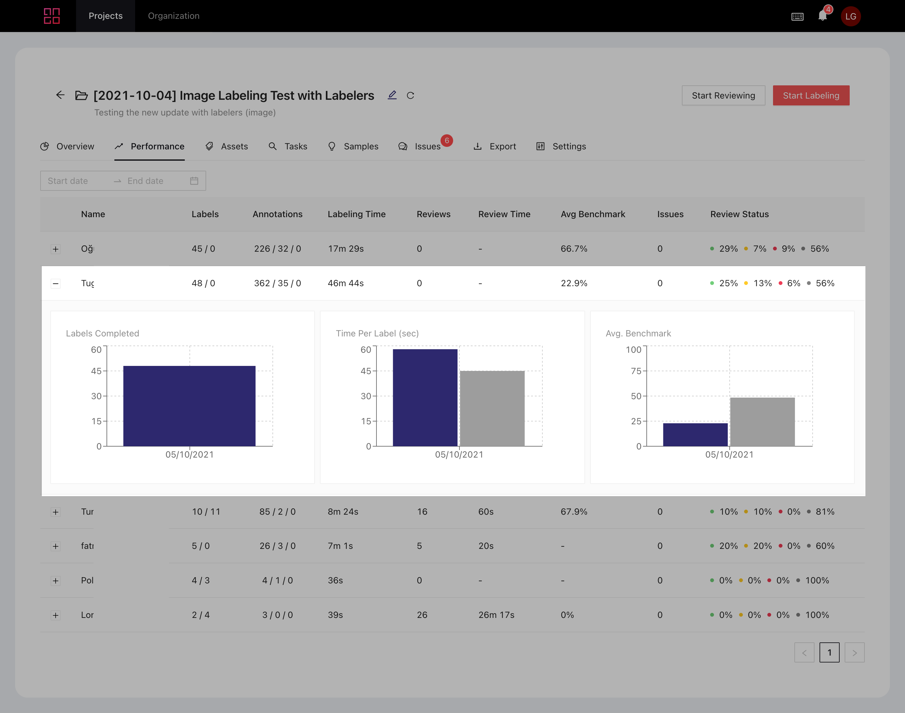

# Labeler Performance

From your project's dashboard, enter the _Performance_ tab. You'll be able to see detailed information about your labelers' performance.

By clicking on the  button next to a member's name, you'll see more detailed statistics about the member in question. The blue bars reflect the annotator's performance, while the gray bars are your organization's average.

## Performance Page Columns

**Labels **_****_ shows how many labeling tasks an annotator has completed, plus how many are left.

**Annotations** is the number and type of annotations an annotator has successfully submitted.

**Labeling Time** is how long each annotator has spent on the project.

**Reviews** is how many reviews a labeler has completed in the project.

**Avg Benchmark** is how well the labeler has performed against benchmark tasks on average.

**Issues** is how many issues the user has opened in the project.
