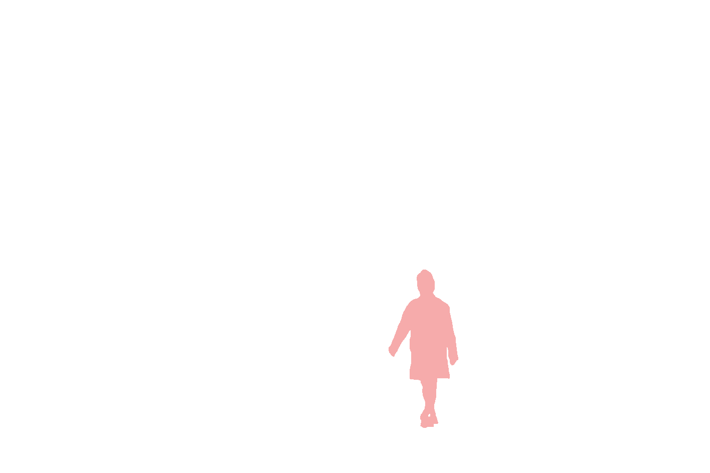

# Objects

The Ango Annotation Format supports the following shapes:

* Point
* Bounding Box
* Rotated Bounding Box
* Polygon
* Segmentation
* Line
* Polyline

Plus [the special "PDF" type](../../labeling/labeling-tools/pdf-tool.md) for natively annotating PDF files.

## Objects in the Ango Annotation Format

### Coordinate System

This is the coordinate system used when determining the position of points in the Ango Annotation Format (AAF).

The origin point lies at the top left corner, and each point has a (X, Y) coordinate pair determining its position, in pixels, on the image.


### Polygon/Segmentation Masks

It is possible to obtain a mask of your polygon or segmentation annotations with a single click. In the _Export_ tab, expand the _Fields_ dropdown and activate the _Mask URLs_ toggle. A Mask URL will be included with tasks that support it.

Code example:

```json
{
  "taskId": "62455155b94ba1000e4e5042",
  "objects": [
    {
      "schemaId": "8cf123179d66155ae575328",
      "objectId": "99af9b1fa7aa801f326c890",
      "classifications": [],
      "masks": [
        "https://mask-url.com/1"
      ],
      "segmentation": {
      ...
      }
    }
  ]
}
```

Mask example:



#### Converting Masks to Ango Segmentation Format

Use the following script to convert masks to the format used in the Ango Annotation Format.

```python
import cv2

def mask_to_segmentation(mask):
    mask = np.uint8(mask)
    contours, hierarchy = cv2.findContours(mask, cv2.RETR_CCOMP, cv2.CHAIN_APPROX_SIMPLE)
    zones = []
    for i, h in enumerate(hierarchy[0]):
        if(contours[i].squeeze().size == 2):
            continue
        
        if h[-1] == -1: # its a region
            zone = {"region": contours[i].reshape((contours[i].shape[0], 2)).tolist()}
            
            holes = []
            child_idx = h[2]
            while child_idx != -1:
                holes.append(np.fliplr(contours[child_idx].reshape((contours[child_idx].shape[0], 2))).tolist())
                child_idx = hierarchy[0][child_idx][0]
            zone['holes'] = holes
            zones.append(zone)
    
    if(len(zones) == 0):
        return {}
    
    segmentation = {"zones": zones}
    return segmentation
```

### Bounding Box

```json
"bounding-box": {
    "x": 200,
    "y": 200,
    "height": 400,
    "width": 400
}
```

* `x` - The X coordinate of the origin point
* `y` - The Y coordinate of the origin point
* `height` - The height, in pixels, of the bounding box
* `width` - The width, in pixels, of the bounding box


The origin point is the point first clicked when placing the bounding box on the asset. It can therefore be any one of the four corners of the box.

Because of this, height and width values can be negative. For example, if the origin point is the bottom-right corner of the box, both width and height values will be negative. If the origin point is the bottom-left corner, then height will be negative, but width will be positive, and so on.


### Rotated Bounding Box

```json
"rotated-bounding-box": {
  "x": 172.9809523809524,
  "y": 101.7904761904762,
  "width": 6.095238095238096,
  "height": 92.03002172095357,
  "rotation": -40.97173633351486,
  "corners": [
    [
      172.9809523809524,
      101.7904761904762
    ],
    [
      233.32380952380956,
      171.2761904761905
    ],
    [
      237.92591615020282,
      167.2796241953753
    ],
    [
      177.58305900734567,
      97.793909909661
    ]
  ]
}
```

* `x` - The X coordinate of the origin point of the rotated bounding box
* `y` - The Y coordinate of the origin point of the rotated bounding box
* `width` - The width of the rotated bounding box, in pixels
* `height` - the height of the rotated bounding box, in pixels
* `rotation` - the angle of rotation of the rotated bounding box, in degrees. Range: -180|+180
* `corners` - A list of X, Y coordinate pairs pertaining to the location of the four corners of the rotated bounding box.

### Polygon

```json
"polygon": [
  [
    149.20952380952383,
    156.64761904761906
  ],
  [
    104.10476190476192,
    192.60952380952384
  ],
  [
    190.04761904761907,
    218.81904761904764
  ],
  [
    191.26666666666668,
    170.05714285714288
  ]
]
```

The polygon shape contains a list of X, Y coordinates of its points. Points are represented consecutively. The first point in the list is the first point that was clicked when creating the polygon.

### Segmentation

Segmentations are composed of instances, zones, regions, and holes.

An instance may contain more than one zone. One zone contains exactly one region. A region can contain more than one hole.

Each of the points composing the segmentation is represented as an X/Y coordinate pair. For more information on how X/Y pairs work in the Ango Annotation Format, check out [this section](objects.md#coordinate-system).

<figure><figcaption></figcaption></figure>


Segmentation point coordinates will not be visible in your export unless you activate the "Segmentation Points" toggle in the _Export_ tab under the _Fields_ dropdown.


```json
{
  "segmentation": {
    "zones": [
      {
        "region": [
          [
            690.4739229024943,
            374.6031746031746
          ],
          [
            714.0204081632653,
            385.3061224489796
          ],
          [
            712.9501133786848,
            386.3764172335601
          ]
        ],
        "holes": []
      },
      {
        "region": [
          [
            570.6009070294784,
            501.968253968254
          ],
          [
            571.6712018140589,
            500.8979591836735
          ],
          [
            573.81179138322,
            496.61678004535145
          ]
        ],
        "holes": [
          [
            [
              594.1473922902494,
              485.9138321995465
            ],
            [
              594.1473922902494,
              490.1950113378685
            ],
            [
              599.4988662131519,
              490.1950113378685
            ]
          ]
        ]
      },
      {
        "region": [
          [
            635.8888888888889,
            679.6371882086167
          ],
          [
            639.0997732426304,
            664.6530612244898
          ],
          [
            639.0997732426304,
            638.9659863945578
          ]
        ],
        "holes": [
          [
            [
              688.3333333333334,
              586.5215419501134
            ],
            [
              688.3333333333334,
              603.6462585034013
            ],
            [
              689.4036281179139,
              606.8571428571429
            ]
          ]
        ]
      }
    ]
  },
  "title": "tramway"
}
```

### Line/Polyline

```json5
"polyline": [
  [
    87.64761904761906,
    232.22857142857146
  ],
  [
    97.4,
    311.4666666666667
  ],
  [
    235.7619047619048,
    322.4380952380953
  ],
  [
    249.1714285714286,
    288.91428571428577
  ]
]
```

The polyline shape contains a list of X, Y coordinates pertaining to the polyline. The order in which the points are presented is the order in which they were placed on the asset.

### Point

```json5
"point": [
    318.6571428571429,
    182.24761904761905
]
```

The point shape contains the X, Y coordinate of the point in question.

### PDF

#### Highlighted Text

Creating annotations by highlighting text on a PDF is nearly identical to manually drawing rects around each token (e.g. word) and transcribing the token. As a result, if you highlighted 4 words, you should see the coordinates of four rects in the export.

```json5
"pdf": {
  "position": {
    "boundingRect": {
      "x1": 26.48284912109375,
      "y1": 89.8125,
      "x2": 146.26641845703125,
      "y2": 109.8125,
      "width": 371.66666666666663,
      "height": 771.6666666666666
    },
    "rects": [
      {
        "x1": 26.48284912109375,
        "y1": 89.8125,
        "x2": 90.283203125,
        "y2": 109.8125,
        "width": 371.66666666666663,
        "height": 771.6666666666666
      },
      {
        "x1": 90.359375,
        "y1": 91.8125,
        "x2": 130.3779296875,
        "y2": 108.46875,
        "width": 371.66666666666663,
        "height": 771.6666666666666
      },
      {
        "x1": 90.359375,
        "y1": 89.8125,
        "x2": 130.3779296875,
        "y2": 109.8125,
        "width": 371.66666666666663,
        "height": 771.6666666666666
      },
      {
        "x1": 130.53125,
        "y1": 89.8125,
        "x2": 146.26641845703125,
        "y2": 109.8125,
        "width": 371.66666666666663,
        "height": 771.6666666666666
      }
    ],
    "pageNumber": 1
  },
  "content": {
    "text": "Deutsche Post AG"
  }
},
"objectId": "fc5027d6307c38d0ee7a017",
"classifications": [],
"metadata": {
  "createdAt": "2022-03-03T11:15:42.017Z",
  "createdBy": "Lorenzo Gravina"
}
```

#### PDF Bounding Box

When using the PDF labeling tool, by pressing ALT, you can draw bounding boxes manually. [More on how the PDF tool works here](../../labeling/labeling-tools/pdf-tool.md). The following is the export obtained after drawing such a box.

```json
"pdf": {
  "position": {
    "boundingRect": {
      "x1": 142.796875,
      "y1": 35.734375,
      "x2": 341.796875,
      "y2": 75.734375,
      "width": 371.66666666666663,
      "height": 771.6666666666666
    },
    "rects": [],
    "pageNumber": 1
  },
  "content": {
    "image": "data:image/png;base64,iVBORw0KGgoAAAANSUhEUgAA[snipped]"
  }
}
```
