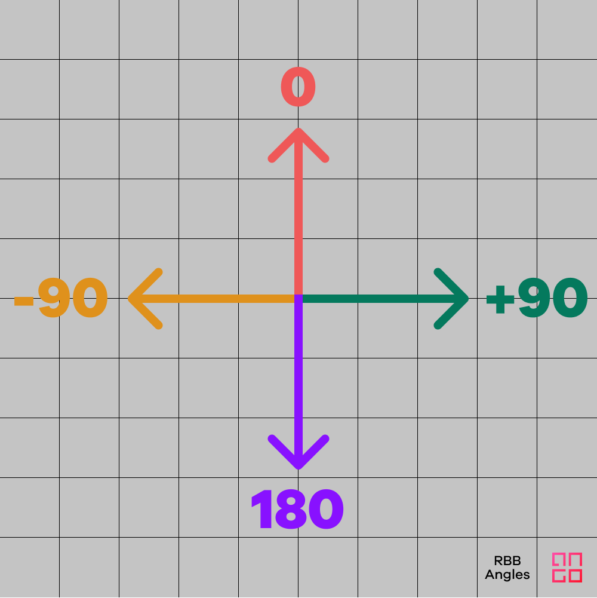

# Ango Import Format

Ango Hub allows administrators and project managers to import existing annotations. [More on label import here](./).

In order to be imported to the platform, existing labels need to be converted to the Ango Hub Import Format. The following article will provide the format’s specifications, as well as examples of import files.

## Quick Start

From the _Label Set_ section of the _Settings_ tab, create your project ontology ([more information on how do do so here](../../../labeling/labeling-tools/))

From the _Assets_ tab, click on _Import._


From the dialog that pops up, click on the _Sample JSON_ toggle.


You will see a sample JSON pre-populated with a basic schema of the import file you need, including schema IDs and structure. You may use this sample as structure for your import JSON.

Read below for more information on how to complete the import file.

## Common Properties

### Assets

#### External ID

The [external ID](../../../core-concepts/assets.md#External-ID) identifies assets in projects.

When [importing assets through the browser](../../importing-assets/asset-browser-import.md), the external ID is assigned automatically, and is equal to the asset's filename. When importing using the [Cloud Import](../../importing-assets/asset-cloud-import.md) function, administrators and project managers must assign this ID manually to each asset. [More on importing assets to Ango Hub here.](../../importing-assets/)


The assets must be imported to Ango Hub before the annotations.

It is not currently possible to bulk upload both assets and annotations with a single import file.


The external ID of each asset can be viewed from the _Assets_ tab of your project, under the _External ID_ column.

External IDs do not have to be unique. You can have more than one asset with the same external ID.


It is possible to import annotations referencing assets with only their external IDs, as in many exampled below. In this situation, all assets sharing the same external ID will be pre-labeled.


### Annotations (Objects)

#### Schema IDs

The Schema ID is a unique identifier for each labeling tool.


If you don't yet know the schema ID of the labeling tool you will use, instead of:

`"schemaId": "my_schema_id"`

you may use the tool's name (title) like so:

`"title": "Name of My Tool"`

This, however, is not recommended since Ango Hub will have to guess which tool you meant. If you have more than one tool with the same name, Ango Hub will pick one randomly.


To obtain each tool's schema ID, navigate to the _Label Set_ section of the _Settings._ You will find it when expanding the details of each tool.



Create and save your project's label set before attempting to import labels.

Ensure the schema IDs in your import file match the ones in the _Label Set_ section of your project's settings.

Nested classifications have their own, separate Schema IDs. They do not inherit the Schema ID of their parent class.


#### Object ID

By default, all objects (annotations) created on Ango Hub, either directly from the platform or by importing them, get assigned a random Object ID used to identify them uniquely.

You may, however, choose to assign a custom object ID to annotations you are importing. This is useful (and necessary) in a number of cases:

* In video annotations, the object ID allows you to move and track the same annotation between frames.
* In [single](../../../labeling/labeling-tools/relation-tools/single-relation.md) and group relations, the Object ID is necessary to relate annotations to one another.

Assigning an object ID manually means that Ango Hub will not create one for the object in question.


Ango Hub will not check nor warn you if you import multiple, different annotations with the same object ID in the same asset or, in the case of videos, in the same frame.

Using the same object ID on more than one object in the same frame can cause unexpected behavior, and may break functionality such as relations.

Unless this is by design, such as tracking an annotation between video frames, always ensure your object IDs are unique to prevent unexpected behaviors.


To add an object ID to any object you are importing, simply add the following line to your object:

```json
"objectId": "<YOUR_OBJECT_ID>"
```

For example, a PDF area object with a custom object ID would look like this:

```json
{
  "title": "box2",
  "bounding-box": {
    "height": 1200,
    "width": 800,
    "x1": 98.2109375,
    "y1": 253.6640625,
    "x2": 342.2109375,
    "y2": 567.6640625,
    "pageNumber": 2,
    "text": "Second Text",
    "objectId": "1234567890"
  }
}
```

You can add custom Object IDs to all annotation types.

#### Lock

You can lock certain annotations so that annotators cannot edit them. To do so, simply add `"lock":true` as a property to an object. For example:

```javascript
[
    {
        "externalId": "test.jpg",
        "objects": [
            {
                "schemaId": "1627287783027",
                "bounding-box": {
                    "x": 270.2113309352518,
                    "y": 238.84892086330933,
                    "width": 107.91366906474819,
                    "height": 122.3021582733813
                },
                "lock": true
            }
        ]
    }
]
```

Lock is available for all annotation types, including classifications, except relations. We plan on supporting locking relations soon.

## Audio Labeling

### Example

```javascript
[
    {
        "externalId": "call_1.mp3",
        "objects": [
            {
                "schemaId": "1629378859077",
                "ner": {
                    "start": 2.05,
                    "end": 6.06
                }
            }
        ]
    },
    {
        "externalId": "call_2.mp3",
        "objects": [
            {
                "schemaId": "1629378859077",
                "ner": {
                    "start": 3.05,
                    "end": 7.06
                }
            }
        ]
    }
]
```


Audio NER Sample Import File


### Explanation

The _start_ and _end_ properties refer to the seconds elapsed since the start of the audio file.

## Image Labeling

### Bounding Box

One asset, named `example.jpg`, annotated with two bounding boxes.

```javascript
[
    {
        "externalId": "example.jpg",
        "objects": [
            {
                "schemaId": "1627286466609",
                "bounding-box": {
                    "x": 192.51348920863308,
                    "y": 166.90647482014387,
                    "width": 66.18705035971223,
                    "height": 61.8705035971223
                }
            },
            {
                "schemaId": "1627286466609",
                "bounding-box": {
                    "x": 435.51348920863308,
                    "y": 456.90647482014387,
                    "width": 67.18705035971223,
                    "height": 44.8705035971223
                }
            }
        ]
    }
]
```


Image Bounding Box Sample Import File


#### Explanation

`x` and `y` refer to the coordinates of the bounding box's top-left corner. The coordinates are calculated starting from the top left corner of the image.

### Bounding Box + Nested Classification

```javascript
[
    {
        "externalId": "test.jpg",
        "objects": [
            {
                "schemaId": "1627287783027",
                "bounding-box": {
                    "x": 270.2113309352518,
                    "y": 238.84892086330933,
                    "width": 107.91366906474819,
                    "height": 122.3021582733813
                },
                "lock": true,
                "classifications": [
                    {
                        "schemaId": "1627287806195",
                        "answer": "Bedside Table"
                    }
                ]
            }
        ]
    },
    {
        "externalId": "test_2.jpg",
        "objects": [
            {
                "schemaId": "1627287783027",
                "bounding-box": {
                    "x": 432.2113453352567,
                    "y": 123.84892086330345,
                    "width": 567.91366906474543,
                    "height": 456.3021582733432
                },
                "lock": false,
                "classifications": [
                    {
                        "schemaId": "1627287806195",
                        "answer": "Bed"
                    }
                ]
            }
        ]
    }
]
```


Image Bounding Box + Classification Sample Import File


### Points

```javascript
[
    {
        "externalId": "image.jpg",
        "objects": [
            {
                "schemaId": "1627303148026",
                "point": [
                    318.9635401054157,
                    459.06634067745796
                ]
            },
            {
                "schemaId": "1627303148026",
                "point": [
                    499.34880220823334,
                    327.63228870028973
                ]
            },
            {
                "schemaId": "1627303148026",
                "point": [
                    679.8971760091927,
                    458.82333195943244
                ]
            },
            {
                "schemaId": "1627303148026",
                "point": [
                    610.9027621652677,
                    671.8832746302957
                ]
            },
            {
                "schemaId": "1627303148026",
                "point": [
                    387.47456459184303,
                    671.7791544308909
                ]
            }
        ]
    }
]
```


Image Points Sample Import File


### Polygon

```javascript
[
    {
        "externalId": "image-filename.jpg",
        "objects": [
            {
                "schemaId": "1627288257181",
                "polygon": [
                    [
                        318.65866681654677,
                        459.15587842226216
                    ],
                    [
                        499.25661033673066,
                        327.7410103167466
                    ],
                    [
                        679.430520872927,
                        459.38557172272294
                    ],
                    [
                        611.3285153127497,
                        672.009579836131
                    ],
                    [
                        387.68648423854864,
                        671.8655200858035
                    ]
                ]
            },
            {
                "schemaId": "1627288257181",
                "polygon": [
                    [
                        234.65866681654677,
                        345.15587842226216
                    ],
                    [
                        456.25661033673066,
                        678.7410103167466
                    ],
                    [
                        543.430520872927,
                        675.38557172272294
                    ],
                    [
                        678.3285153127497,
                        234.009579836131
                    ],
                    [
                        548.68648423854864,
                        345.8655200858035
                    ]
                ]
            }
        ]
    },
    {
        "externalId": "image-filename-2.jpg",
        "objects": [
            {
                "schemaId": "1627288257181",
                "polygon": [
                    [
                        318.65866681654677,
                        459.15587842226216
                    ],
                    [
                        499.25661033673066,
                        327.7410103167466
                    ],
                    [
                        679.430520872927,
                        459.38557172272294
                    ],
                    [
                        611.3285153127497,
                        672.009579836131
                    ],
                    [
                        387.68648423854864,
                        671.8655200858035
                    ]
                ]
            },
            {
                "schemaId": "1627288257181",
                "polygon": [
                    [
                        345.65866681654677,
                        567.15587842226216
                    ],
                    [
                        789.25661033673066,
                        234.7410103167466
                    ],
                    [
                        654.430520872927,
                        765.38557172272294
                    ],
                    [
                        987.3285153127497,
                        356.009579836131
                    ],
                    [
                        252.68648423854864,
                        575.8655200858035
                    ]
                ]
            }
        ]
    }
]
```


Image Polygon Sample Import File


### Rotated Bounding Box

Rotated Bounding Boxes are identical to Bounding Boxes, except they have a rotation element.

Boxes rotate from their center.

Here is what the rotation parameter means:

<figure><figcaption></figcaption></figure>

```json
[
  {
    "data": "https://asset.url/image-sample.jpg",
    "objects": [
      {
        "schemaId": "c1229e4944937f9ac0a1022",
        "title": "Top Left",
        "rotated-bounding-box": {
          "width": 100,
          "height": 100,
          "x": 100,
          "y": 100,
          "rotation": -12
        }
      },
      {
        "schemaId": "7b114683840c7ed5890d501",
        "title": "Top Right",
        "rotated-bounding-box": {
          "width": 100,
          "height": 100,
          "x": 100,
          "y": 100,
          "rotation": -12
        }
      },
      {
        "schemaId": "3a438a04aea8f832c6dc742",
        "title": "Bottom Left",
        "rotated-bounding-box": {
          "width": 100,
          "height": 100,
          "x": 100,
          "y": 100,
          "rotation": -12
        }
      },
      {
        "schemaId": "eae41e5fbd13cd15c746110",
        "title": "Bottom Right",
        "rotated-bounding-box": {
          "width": 100,
          "height": 100,
          "x": 100,
          "y": 100,
          "rotation": -12
        }
      }
    ]
  }
]
```

### Segmentation


Segmentations are composed of instances, zones, regions, and holes.

An instance may contain more than one zone. One zone contains exactly one region. A region can contain more than one hole.

Each of the points composing the segmentation is represented as an X/Y coordinate pair. For more information on how X/Y pairs work in the Ango Annotation Format, check out [this section](ango-hub-import-format.md#coordinate-system). For the way Ango Hub exports segmentation labels, check out [this page](../../ango-export-format/objects.md#segmentation).



```json
[
  {
    "data": "https://asset.url/image-sample.jpg",
    "objects": [
      {
        "schemaId": "ff82c4fdf3287c08bb92577",
        "title": "Person",
        "segmentation": {
          "zones": [
            {
              "region": [
                [
                  690.4739229024943,
                  374.6031746031746
                ],
                [
                  714.0204081632653,
                  385.3061224489796
                ],
                [
                  712.9501133786848,
                  386.3764172335601
                ]
              ],
              "holes": []
            },
            {
              "region": [
                [
                  570.6009070294784,
                  501.968253968254
                ],
                [
                  571.6712018140589,
                  500.8979591836735
                ],
                [
                  573.81179138322,
                  496.61678004535145
                ]
              ],
              "holes": [
                [
                  [
                    594.1473922902494,
                    485.9138321995465
                  ],
                  [
                    594.1473922902494,
                    490.1950113378685
                  ],
                  [
                    599.4988662131519,
                    490.1950113378685
                  ]
                ]
              ]
            },
            {
              "region": [
                [
                  635.8888888888889,
                  679.6371882086167
                ],
                [
                  639.0997732426304,
                  664.6530612244898
                ],
                [
                  639.0997732426304,
                  638.9659863945578
                ]
              ],
              "holes": [
                [
                  [
                    688.3333333333334,
                    586.5215419501134
                  ],
                  [
                    688.3333333333334,
                    603.6462585034013
                  ],
                  [
                    689.4036281179139,
                    606.8571428571429
                  ]
                ]
              ]
            }
          ]
        }
      }
    ]
  }
]
```

## Video Labeling

Video labeling is functionally the same as image labeling, with the only difference being that we add an extra _page_ property to indicate the frame to which the annotation belongs. An example will clarify:

```json
[
  {
    "externalId": "20220728172632_20220728_173611_0002.mp4",
    "objects": [
      {
        "schemaId": "fb4771a3d540f9c3ad8e084",
        "objectId": "12345",
        "page": 6,
        "title": "Tumors",
        "bounding-box": {
          "x": 192.51348920863308,
          "y": 166.90647482014387,
          "width": 66.18705035971223,
          "height": 61.8705035971223
        }
      },
      {
        "schemaId": "fb4771a3d540f9c3ad8e084",
        "objectId": "12345",
        "page": 7,
        "title": "Tumors",
        "bounding-box": {
          "x": 192.51348920863308,
          "y": 166.90647482014387,
          "width": 66.18705035971223,
          "height": 61.8705035971223
        }
      },
      {
        "schemaId": "fb4771a3d540f9c3ad8e084",
        "objectId": "12345",
        "page": 8,
        "title": "Tumors",
        "interpolationStopped": true,
        "bounding-box": {
          "x": 192.51348920863308,
          "y": 166.90647482014387,
          "width": 66.18705035971223,
          "height": 61.8705035971223
        }
      }
    ]
  }
]
```

## PDF Labeling

### PDF Area

A PDF named `sample.pdf` with two PDF Areas.

```json
[
  {
    "externalId": "sample.pdf",
    "objects": [
      {
        "schemaId": "4305179f65f01fd8a757445",
        "title": "PDF Tool 1",
        "pdf": {
          "height": 1200,
          "width": 800,
          "x1": 100,
          "y1": 250,
          "x2": 200,
          "y2": 350,
          "pageNumber": 1,
          "text": "You can place your OCR results here, for example."
        }
      },
      {
        "schemaId": "4305179f65f01fd00000005",
        "title": "PDF Tool 2",
        "pdf": {
          "height": 1200,
          "width": 800,
          "x1": 100,
          "y1": 250,
          "x2": 200,
          "y2": 350,
          "pageNumber": 2,
          "text": "Label Text"
        }
      }
    ]
  }
]
```

A PDF named `sample.pdf` with three PDF areas grouped together in a relation.

```json
[
  {
    "externalId": "sample.pdf",
    "objects": [
      {
        "schemaId": "4305179f65f01fd8a757445",
        "title": "PDF Tool 1",
        "pdf": {
          "height": 1200,
          "width": 800,
          "x1": 100,
          "y1": 250,
          "x2": 200,
          "y2": 350,
          "pageNumber": 1,
          "text": "You can place your OCR results here, for example.",
          "objectId": "1"
        }
      },
      {
        "schemaId": "4305179f65f01fd00000005",
        "title": "PDF Tool 2",
        "pdf": {
          "height": 1200,
          "width": 800,
          "x1": 100,
          "y1": 250,
          "x2": 200,
          "y2": 350,
          "pageNumber": 2,
          "text": "Label Text",
          "objectId": "2"
        }
      },
      {
        "schemaId": "4305179f65f01fd00000006",
        "title": "PDF Tool 2",
        "pdf": {
          "height": 1200,
          "width": 800,
          "x1": 100,
          "y1": 250,
          "x2": 200,
          "y2": 350,
          "pageNumber": 1,
          "text": "Label Text",
          "objectId": "3"
        }
      }
    ],
    "relations": [
      {
        "title": "My Group Relation",
        "schemaId": "16d9a091e9fa8db91947042",
        "group": [
          "1",
          "2",
          "3"
        ]
      }
    ]
  }
]
```

## Classification

### Nested Multi-Dropdowns

```javascript
[
  {
    "externalId": "audio.mp3",
    "classifications": [
      {
        "answer": [
          "First-Level Multiple Dropdown",
          "Answer 2"
        ],
        "schemaId": "1627302702396",
        "classifications": [
          {
            "answer": [
              "Second-Level Multiple Dropdown",
              "Answer 4"
            ],
            "schemaId": "1627302702654"
          }
        ]
      }
    ]
  },
  {
    "externalId": "audio2.mp3",
    "classifications": [
      {
        "answer": [
          "First-Level Multiple Dropdown",
          "Answer 2"
        ],
        "schemaId": "1627302702396",
        "classifications": [
          {
            "answer": [
              "Second-Level Multiple Dropdown",
              "Answer 4"
            ],
            "schemaId": "1627302702654"
          }
        ]
      }
    ]
  }
]
```


Nested Multi-Dropdown Sample Import File


### Tree Dropdowns

```json
[
  {
    "data": "https://asset.png",
    "classifications": [
      {
        "schemaId": "26347366bb8f491cc82c690",
        "tool": "tree-dropdown",
        "title": "Title",
        "columnField": false,
        "answer": [
          "Trunk",
          "Trunk / Branch 2",
          "Trunk / Branch 1 / Leaf",
          "Trunk / Branch 2 / Leaf 2"
        ],
        "lock": true
      }
    ]
  }
]
```

Will result in the tree looking like this:

<figure><figcaption></figcaption></figure>

### Text

#### NER

```javascript
[
    {
        "externalId": "testing-text.txt",
        "objects": [
            {
                "schemaId": "1629378613473",
                "ner": {
                    "start": 3,
                    "end": 7
                }
            }
        ]
    },
    {
        "externalId": "text_file.txt",
        "objects": [
            {
                "schemaId": "1629378613473",
                "ner": {
                    "start": 2,
                    "end": 6
                }
            }
        ]
    }
]
```


Text NER Sample Import File


## Relations

### Single

```json
[
  {
    "externalId": "Base flipped.png",
    "objects": [
      {
        "schemaId": "9c2840f98b4849450ed2011",
        "objectId": "12345",
        "title": "",
        "bounding-box": {
          "width": 120.005,
          "height": 135.345,
          "x": 50.3,
          "y": 30.4
        }
      },
      {
        "schemaId": "9c2840f98b4849450ed2011",
        "objectId": "123456",
        "title": "",
        "bounding-box": {
          "width": 120.005,
          "height": 135.345,
          "x": 400.3,
          "y": 400.4
        }
      }
    ],
    "relations": [
      {
        "title": "",
        "schemaId": "f3ed60cb6fbb4031eac8603",
        "from": "12345",
        "to": "123456"
      }
    ]
  }
]
```

### Group

```json
[
  {
    "externalId": "Base flipped.png",
    "objects": [
      {
        "schemaId": "9c2840f98b4849450ed2011",
        "objectId": "12345",
        "title": "",
        "bounding-box": {
          "width": 120.005,
          "height": 135.345,
          "x": 50.3,
          "y": 30.4
        }
      },
      {
        "schemaId": "9c2840f98b4849450ed2011",
        "objectId": "123456",
        "title": "",
        "bounding-box": {
          "width": 120.005,
          "height": 135.345,
          "x": 400.3,
          "y": 400.4
        }
      },
      {
        "schemaId": "9c2840f98b4849450ed2011",
        "objectId": "1234567",
        "title": "",
        "bounding-box": {
          "width": 120.005,
          "height": 135.345,
          "x": 200.3,
          "y": 200.4
        }
      }
    ],
    "relations": [
      {
        "title": "",
        "schemaId": "16d9a091e9fa8db91947042",
        "group": [
          "12345",
          "123456",
          "1234567"
        ]
      }
    ]
  }
```
