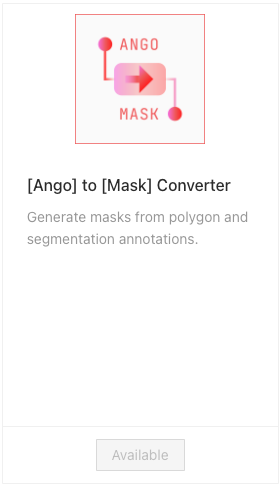

# Importing Brush Traces

You may import PNG masks as pre-labels for the [Brush labeling tool](../../../labeling/labeling-tools/brush-bucket.md) in Ango Hub.

## How to Import Masks as Brush Annotations

1. In your project, navigate to _Settings_, and then to _Category Schema_. Ensure your project has the Brush tool classes you intend to import.
2. For each Brush tool in your project, take note of its hexadecimal color value. You can do so by pressing on the  _Show JSON_ button on the right.

For example, in the following project, I have a single Brush labeling tool, and its hex color value is `#f44336`.

<figure><figcaption></figcaption></figure>

3. Prepare the PNG masks you intend to import. The PNG masks need to:
   1. Have the same dimension as the image asset to annotate
   2. Have a completely transparent background (`255, 255, 255, 0`)
   3. Have the mask contents' colors be the same as the colors of the brush tools in your project on Hub. The masks need to be fully opaque (e.g. alpha channel value 0) and never have colors outside of the ones determined in step 2.


Ensure that the masks you are importing have the same color value as the brush tool you wish to associate the mask with as per step 2.

In the same PNG mask you may import traces for more than one brush class, as long as the color of each trace matches the color of each class on Hub.

Assuming you had one brush class on Hub with the hex color value `f44336`, the following would be a valid PNG mask:




4. Prepare the JSON to import to Hub, in the following format:

```json
[
  {
    "externalId": "0a6e52c9-1eda-426f-8bcb-e6b1cd45668c.png",
    "brushDataUrl": "https://domain.s3.eu-central-1.amazonaws.com/brush-import-samples/0a6e52c9-1eda-426f-8bcb-e6b1cd45668c.png"
  },
  {
    "externalId": "0e9ee946-ebaa-4847-99ee-ce7386795333.png",
    "brushDataUrl": "https://domain.s3.eu-central-1.amazonaws.com/brush-import-samples/0e9ee946-ebaa-4847-99ee-ce7386795333.png"
  },
  {
    "externalId": "0eaf2333-5533-4353-ac3d-55774b6adb47.png",
    "brushDataUrl": "https://domain.s3.eu-central-1.amazonaws.com/brush-import-samples/0eaf2333-5533-4353-ac3d-55774b6adb47.png"
  },
  {
    "externalId": "0ebf0551-6c2d-4b6e-9a46-d5e1a5f22e72.png",
    "brushDataUrl": "https://domain.s3.eu-central-1.amazonaws.com/brush-import-samples/0ebf0551-6c2d-4b6e-9a46-d5e1a5f22e72.png"
  },
  {
    "externalId": "0f6d11a6-4fb0-4973-a8a3-d702de764548.png",
    "brushDataUrl": "https://domain.s3.eu-central-1.amazonaws.com/brush-import-samples/0f6d11a6-4fb0-4973-a8a3-d702de764548.png"
  }
]
```

Where `externalId` is the external ID of the asset to pre-annotate, and `brushDataUrl` is a link to your publicly-accessible PNG mask.

5. In your project, navigate to the _Assets_ tab, then click on _Import_. Drag and drop the JSON file you have just prepared. Your assets will be pre-labeled.
