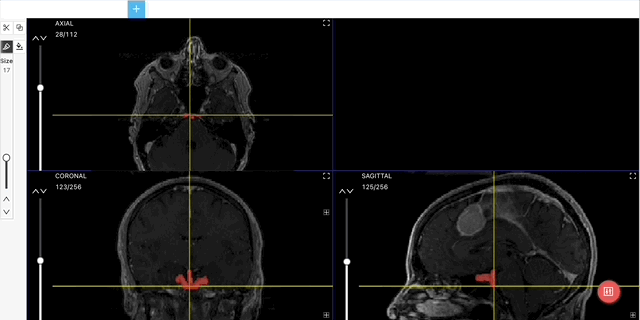
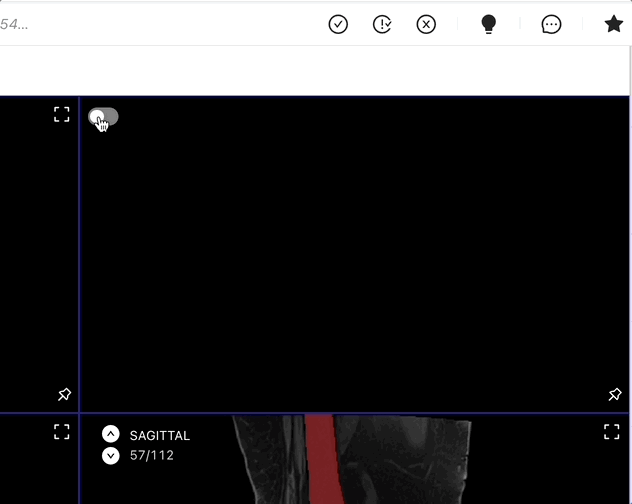

# New Medical Labeling Editor


The New Medical Editor is in beta, and not all functionality may be available.

It is not yet suitable for use for production purposes.

The New Medical Editor is not currently available publicly. Please contact us at info \[at] ango.ai if you wish to participate in our beta and provide feedback.


Ango Hub provides a medical labeling editor, in which annotators can label medical files in the NRRD and NIFTI formats.

This is contrast to the [DICOM editor](dicom-labeling-editor.md), which relies on an older version of our editor code. Eventually, all medical files, including DICOM, will be able to be labeled using the new editor.

<figure><figcaption></figcaption></figure>

The new medical editor will be opened when the user clicks on a labeling [task](../../core-concepts/tasks.md) linked to an [asset](../../core-concepts/assets.md) ending with the `.nrrd .nii .nii.gz` file extensions.


Only the _Medical Brush_ labeling tool can be used in the new medical editor.


## Overview of the Interface

By default, the _Axial_ view will be shown in the top left, the _Coronal_ view in the bottom left, and the _Sagittal_ view in the bottom right.

In an upcoming update, a 3D reconstruction of the three aforementioned views will be shown in the top-right view.

<figure><figcaption></figcaption></figure>

**Crosshair Toggle**: toggles the crosshair on or off. More information on the crosshair [in its own section](new-medical-labeling-editor.md#multiplanar-translation-and-crosshair).

**Window Options**: Change the window width and level. [See the section below](new-medical-labeling-editor.md#windowing-options) for more on window options.

**Smoothing Tool**: _Coming in a future update._

**Threshold Tool**: Paint all pixels with values falling between two values you specify. Details in [its own section](new-medical-labeling-editor.md#threshold).

**Slice Navigator**: Slider allowing you to move between slices in the view. Drag the slider up and down to move between slices, or click on the up and down arrows on the top left of the view.

**View Info**: Name of the current view and current slice/total number of slices.

**Recenter View**: if you have zoomed in or panned, clicking this button resets the zoom level and pan position for the view and re-centers the asset.

**Enlarge View**: Clicking this hides the other three views and makes the selected one the only visible view on the screen, enlarged to take up all available space. Clicking it again reverts the process.

**3D Toggle**: Toggle on and off a 3D reconstruction of the annotations done so far. Note: the view does not update automatically. To update it, toggle the 3D view off and on again.

### Windowing Options

Clicking on the "Window" icon will enable window keyboard shortcuts, detailed in the [Keyboard Shortcuts](new-medical-labeling-editor.md#keyboard-shortcuts) section below.

Hovering over it reveals a number of options related to changing how the asset is viewed.

<figure><figcaption></figcaption></figure>

**Window Width** and **Level**: Move the slider, or type in a value to change the window's width and level.

**Preset**: Ango Hub has a variety of width/level presets, ideal for quickly setting a W/L pair allowing you to highlight certain elements of the view. For example, selecting the _Lung_ preset will set W/L in such a way that lungs are highlighted, and so on for all other presets.

### Multiplanar Translation & Crosshair

The crosshair allows you to gather your bearings in 3D space and to understand where your cursor is positioned relative to all views.

It also allows you to synchronize all views in such a way that they all show the same pixel you are selecting with the crosshair. This is also known as multiplanar translation.

To toggle the crosshair, click on the _Crosshair Toggle_:

.png>)

Move your cursor over a view while holding _Shift_. You will see that all views will navigate between slices in such a way as to always show the pixel you are hovering over with the crosshair:

<figure><figcaption></figcaption></figure>

To hide the crosshair, click on the _Crosshair Toggle_ again.

You can still perform multi-planar translation even with the crosshair turned off, just by doing Shift + Move Cursor.

### 3D View

By enabling the 3D toggle shown in the [previous section](new-medical-labeling-editor.md#overview-of-the-interface), you'll be able to see a 3D reconstruction of the annotations completed so far in the top-right view.

You can rotate the view by dragging with the mouse cursor, and zoom in and out with the scroll wheel.

Note that the view does not get updated in real time. You will need to toggle it off and on again to update it.

<figure><figcaption></figcaption></figure>

## The Medical Brush Tool

### Brush Options

From your project's settings, navigate to the _Category Schema_ section and add a new _Medical Brush_ tool. When you open an `.nrrd` file and click on a _Medical Brush_ tool, the brush options will appear:

<figure><figcaption></figcaption></figure>

**Hide Annotations**: Hides all annotations created with the brush the name of which is to the left of the icon.

**Delete Annotations**: Deletes all annotations created with the brush the name of which is to the left of the icon.

**Brush Size**: Slider to adjust the size of the brush tool.

**Brush Mode**: Selector to pick whether the brush/pen should add (Paint) or whether it should erase (Eraser.)

**Brush Type**: (Coming soon). Pick between 2D and 3D brush.

**Overwrite Toggle**: When active, when you paint with the brush/pen over pre-existing traces, the traces that have been covered will be deleted and overwritten with the new traces.

To use the _Medical Brush_ tool, simply click with the left mouse button where you'd like to place the annotation. You can click and drag if necessary, and you may use either the slider mentioned above or the keyboard shortcuts mentioned below to change the size of the brush and other settings.

### Threshold

The Threshold tool allows you to paint all pixels with a value falling between a range you specify.

The Threshold tool is a subset of the Medical Brush tool. To activate the threshold tool, first select a Medical Brush tool from the toolbar on the left, then click on the _Threshold_ button. From the dialog that pops up, specify two values using the slider. The view will update and show in green the pixels that would be painted with the values currently selected.

When you wish to finalize the threshold annotation, click on _Apply_. The highlighted pixels will be painted over with the tool previously selected.

<figure><figcaption></figcaption></figure>

### Pen

The Pen tool allows you to draw a region of pixels to paint, similar to the [Segmentation](../labeling-tools/segmentation.md) tool for images.

The pen tool is a subset of the Medical Brush tool. To activate the pen tool, first select a Medical Brush tool from the toolbar on the left, then click on the _Brush_ button. From the dialog that pops up, activate the _Pen_ toggle.

<figure><figcaption></figcaption></figure>

With the pen tool selected, draw over the image surrounding the pixels you'd like to paint. When you are done, press N to close the loop. All pixels found inside the loop will be painted.

## Importing NRRD Segmentations

Ango Hub allows you to import existing NRRD segmentations as pre-labels.

To do so, follow the steps outlined in the page [Importing NRRD Annotations](../../data/importing-and-exporting-annotations/importing-annotations/importing-nrrd-annotations.md).

## Keyboard Shortcuts

| Condition                           | Shortcut               | Action                  | Description                                                                                                       |
| ----------------------------------- | ---------------------- | ----------------------- | ----------------------------------------------------------------------------------------------------------------- |
| Always                              | Space + Drag Cursor    | Pan                     | Pans the view.                                                                                                    |
| Always                              | Ctrl + Mouse Wheel     | Zoom                    | Zooms the view being currently hovered by the mouse cursor.                                                       |
| Always                              | Shift + Move Cursor    | Multiplanar Translation | Navigates between slices in all other views to show the pixel you are hovering over in all views.                 |
| Always                              | Ctrl + Z               | Undo                    | Undo the last action.                                                                                             |
| Always                              | Ctrl + Shift + Z       | Redo                    | Redo the last undone action.                                                                                      |
| Always                              | Mouse Wheel            | Navigate Slices         | Move up and down between slices.                                                                                  |
| Always                              | Middle Mouse Button    | Pan                     | Pans the view.                                                                                                    |
| When no labeling tools are selected | Click and Drag         | Pan                     | Pans the view.                                                                                                    |
| When no labeling tools are selected | Double Click           | Full Screen             | Switch between four-view and single-view modes.                                                                   |
| When a labeling tool is selected    | Shift + Mouse Wheel    | Change Tool Size        | Changes the size of the tool.                                                                                     |
| When a labeling tool is selected    | W and Q                | Change Tool             | Move up and down in the tool list, changing the currently active tool.                                            |
| When the "Window" icon is selected  | Drag cursor up/down    | Change Brightness       | Dragging the cursor downwards will increase the brightness, dragging it upwards will decrease it.                 |
| When the "Window" icon is selected  | Drag cursor left/right | Change Contrast         | Moving the cursor to the left while holding Ctrl will increase contrast, moving it to the right will decrease it. |
| When the "Pen" tool is selected     | N                      | Close Pen Trace         | Closes the loop drawn with the pen and paints the pixels found inside it.                                         |

## NRRD Exports

Exports obtained from the NRRD editor work differently from exports obtained with our other editors.

While you can obtain the export [the same way](../../data/importing-and-exporting-annotations/exporting-annotations.md), the brush data is not contained directly within the text export itself, instead, the text export contains a link to a NRRD file containing your annotations.

A sample NRRD export looks like this:

```json
[{
  "asset": "https://asset.url/asset.nrrd",
  "externalId": "RegLib_C01_1.nrrd",
  "metadata": {},
  "labeledAt": "2023-02-01T10:14:35.584Z",
  "status": "Labeled",
  "labelDuration": 8152266,
  "consensus": "",
  "tasks": [
    {
      "completedBy": "NAME SURNAME",
      "completedAt": "2023-02-01T10:14:35.584Z",
      "duration": 8152266,
      "isSkipped": false,
      "review": {
        "status": "Todo",
        "completedBy": [],
        "completedAt": null,
        "duration": 0,
        "isSkipped": false
      },
      "status": "Completed",
      "updatedBy": "NAME SURNAME",
      "updatedAt": "2023-02-01T10:14:40.947Z",
      "isBenchmark": false,
      "benchmark": "",
      "issues": [],
      "taskId": "63d0e32ad8157d000eace053",
      "medicalBrushDataUrl": "https://angohub-public-assets.s3.eu-central-1.amazonaws.com/63d0e32ad8157d000eace053.zip",
      "objects": [],
      "classifications": [],
      "relations": []
    }
  ],
  "batches": []
}]
```

The brush data is contained in the URL linked to in the `medicalBrushDataUrl` property. Once you enter the URL, download the .zip and unzip it, you will receive a .nrrd file containing your annotations. For example, this is what the open NRRD would look like, with simple circular annotations:

<figure><figcaption></figcaption></figure>
