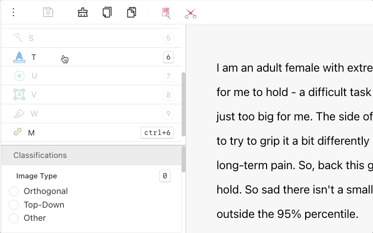

# Text (NER) Labeling Editor

Ango Hub provides a labeling editor with which text files can be annotated.

This article will exclusively go over Ango Hub’s text (NER) labeling interface. Features common to all labeling editors (audio, image, PDF, and text) are instead [explained here](./).

.png>)

## The Text Annotation Interface in Ango Hub 

### How to Annotate Text 

From the _Tools_ panel on the left sidebar, select an _Entity_ labeling tool, marked with an underlined _A_. (If none are present, only answer the questions in the _Questions_ panel.)

.png>)

With the _Entity_ tool selected, click and drag on text to highlight the text you’d like to label.

If the labels have nested questions, select a label by clicking on it, then right-click on each label and click on the menu item that appears to see and answer the nested questions.

If classification questions are present, you may answer them from the _Questions_ panel on the left sidebar.

.png>)

### Editing Text Annotations 

After selecting a label by clicking on it, hover over one of the edges of the annotation until your cursor turns into an arrow. Click and drag the annotation to where you'd like it to start or end.

<figure><figcaption></figcaption></figure>

### Keyboard Shortcuts 

A full list of keyboard shortcuts is available by clicking on the _Keyboard_ button on the right side of the top bar:

.png>)

### Further reading


[audio-labeling-editor.md](audio-labeling-editor.md)



[image-labeling-editor.md](image-labeling-editor.md)



[pdf-labeling-editor.md](pdf-labeling-editor.md)



[.](./)

