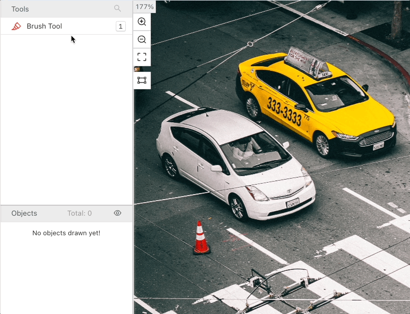
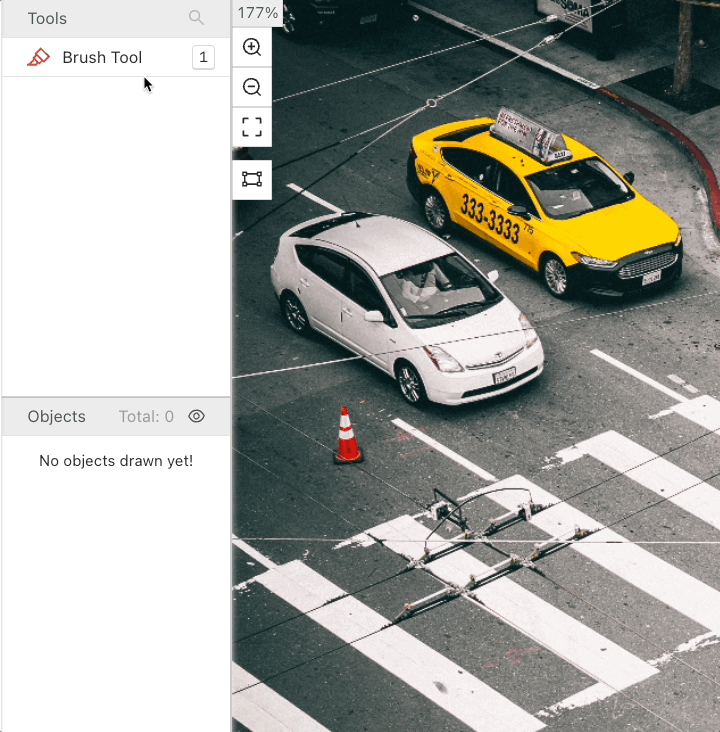

# Brush and Bucket

The brush labeling tool allows you to "paint" on an image or video frame. The _Brush_ tool also includes a bucket to paint areas of similar color.

<figure><figcaption></figcaption></figure>

## Adding a Brush tool to your project 

From the project’s _Settings_ tab, enter the _Category Schema_ section.

Click on _Add Category_. From the list that appears, click on _Brush_.

A new row will appear named _Bounding Box_. Click on it to expand it.

<figure><figcaption></figcaption></figure>

Give your brush tool a title and description.

Enable the _Required_ toggle if you want to force labelers to create brush traces for each asset. When the toggle is disabled, labelers will be able to save and move to the next asset without creating brush traces using the class you've just created.

If you would like to ask labelers further questions, for example, if you want to show a further _radio_ after drawing brush traces, click on _Add Classification_ and add a further question. [More on nested questions here](nested-classifications.md).

### Brush and Bucket Options 

When you select a _Brush_ tool, a number of options will appear on screen, allowing you to pick a tool between brush and bucket, and more. Here is what will appear once you select a brush:

<figure><figcaption></figcaption></figure>

**Region of Interest Tool**: Click on the button to activate the Region of Interest tool. More on [its own section](brush-bucket.md#how-to-draw-a-bounding-box-2).

**Scissors**: When the Brush tool is selected and the scissors are enabled, the brush will act as an eraser and erase existing traces.

**Overwrite**: Normally, the brush will not paint over existing traces. When this toggle is enabled, it will.

**Brush/Bucket**: switch between the _Brush_ and _Bucket_ tools.

**Size/Threshold Slider**: Change the size of the brush tool, or the threshold (e.g. sensitivity, tolerance) of the bucket tool.

When the Bucket tool is selected, the _Scissors_ options is disabled, and a new _Contiguous_ option appears.

.png>)

**Contiguous**: When disabled, clicking on a color on the image will select all pixels of the same and similar colors on the image regardless of position. When active, it will limit itself to a contiguous area.

## Using the Brush 

Select a _Brush_ tool from the _Tools_ section in the left sidebar of the labeling editor. Click and drag on the image where you'd like to draw traces. Use the Scissors as necessary to erase traces.

Deselect the brush tool when you are done.

<figure><figcaption></figcaption></figure>

## Using the Bucket

Select a Brush tool from the _Tools_ section, then toggle the Bucket tool.

Choose whether the bucket should behave contiguously or not, then click on a color. The color you're hovering over will be visualized on top of the tolerance slider.

Change the tolerance as necessary. When you are satisfied, click on the .png>)below the slider to finalize your bucket annotation..

<figure><figcaption></figcaption></figure>

## Set a Region of Interest (Tracing Boundaries) 

You may need to limit your bucket and brush traces to a limited area. This is what the Region of Interest (ROI) tool is designed to do.

Toggle the ROI tool on and draw an area. All brush and bucket traces will be limited to that area. Toggle ROI again to remove your boundaries.

<figure><figcaption></figcaption></figure>

## Keyboard Shortcuts

| Condition          | Keyboard Shortcut | Action                  |
| ------------------ | ----------------- | ----------------------- |
| Brush is selected  | Shift + Scroll    | Change Brush Size       |
| Bucket is selected | Shift + Scroll    | Change Bucket Tolerance |
