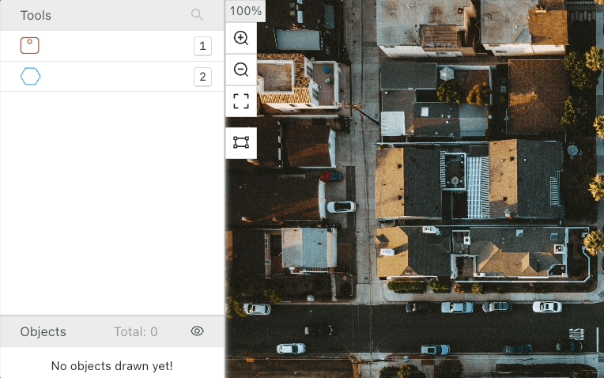

# Polygon

The polygon labeling tool allows you to draw a polygon around an object or point of interest in an image.

.png>)

## The Polygon Labeling Tool in Ango Hub 

### How to add a Polygon tool to your project 

From the project’s _Settings_ tab, enter the _Label Set_ section.

Click on _Add Category_. From the list that appears, click on _Polygon_.

A new row will appear named _Polygon_. Click on it to expand it.

<figure><figcaption></figcaption></figure>

Give your polygon tool a title and description.

Enable the _Required_ toggle if you want to force labelers to create a polygon on every asset. When the toggle is disabled, labelers will be able to save and move to the next asset without creating a polygon.

If you would like to ask labelers further questions, for example, if you want to show a further _radio_ after drawing the polygon, click on _Add Classification_ and add a further question. More[ on nested questions here](nested-classifications.md).

### How to Draw a Polygon 

Click on the image where you’d like the first point of the polygon to be. Click again where you’d like the second point to be, and so on. When you are done, click on the first point again or press on _N_ on your keyboard to close the polygon.

.png>)

While drawing, you may click anywhere with the right mouse button to delete the last point you have placed.

To add a new point after closing the polygon, hold CTRL and click on a point. To delete a point, hold CTRL and right-click on the point you’d like to delete.

To quickly trace a polygon without having to click on each point manually, after having drawn the first point, hold _Shift_ then start moving your cursor:

<figure><figcaption></figcaption></figure>
