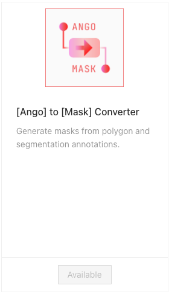

# Ango Export to PNG Mask Converter Plugin

The Ango to Mask plugin allows you to download your polygons and segmentations in a PNG format as a mask.

<figure><figcaption></figcaption></figure>

## Plugin Functionality

Adding the plugin to your organization will allow you to download the polygon and segmentations in your project as a PNG mask.

## Using the Ango to Mask Converter Plugin

From the Plugin Directory, search for the the name of the converter plugin of your choice and install the plugin to your organization. More information on installing plugins can be found in the [Installing Plugins](../installing-plugins.md) page.

Currently, the names of the plugin is the following:

* \[Ango] to \[Mask] Converter

### Usage

Navigate to the project where you'd like to get the export.

Enter the _Settings_ tab, then the _Plugins_ section.

Find the plugin, and click on _Open._ A dialog will appear:

<figure><figcaption></figcaption></figure>


Ensure the dot before the plugin's name is green. The dot indicates the plugin's status, where green signifies the plugin's code is running, and red signifies the plugin's code is not running.

You will not be able to run plugins the code of which isn't running.


If you wish to receive an email when the export is complete, toggle _Send Email_ on.

You may vary a number of settings related to your export from the _Config JSON_ field. Each option is detailed below:

#### Plugin Configuration

* `class_mapping_type:` set this to any one value among the following to determine the color values of the resulting PNG:
  * `single_channel_sequential` \[1-channel mask (grayscale image)]
    * {'class\_1': 1, 'class\_2': 2, 'class\_3': 3, ...}
  * `single_channel_diverging` \[1-channel mask (grayscale image)]
    * {'class\_1': 255, 'class\_2': 128, 'class\_3': 192, 'class\_4': 64 ...}
  * `multi_channel_qualitative` \[3-channel mask (color image)] → _Pre-defined colors_
    * 'class\_1': (R1, G1, B1), 'class\_2': (R2, G2, B2), 'class\_3': (R3, G3, B3), ...}
  * `project_colors` \[3-channel mask (color image)] → _colors used on the AngoHub_
    * 'class\_1': (R1, G1, B1), 'class\_2': (R2, G2, B2), 'class\_3': (R3, G3, B3), ...}
* `export_reviewed_assets`: set this to `true` to get the export of labeling tasks that have been reviewed.
* `export_labeled_assets`: set this to `true` to get the export of labeling tasks that have been labeled. (e.g., by turning this off, you can choose to only get the export for tasks that have been reviewed, or by doing the opposite, only of tasks that have not.)
* `batch_names`: enter a list of batch names here to only export assets belonging to the specified assets.
  * Example: `"batch_names": ["my_batch_1", "my_batch_2"]`
* `verbose`: set this to true to turn on logging for the plugin. [See here](../monitoring-plugin-progress.md) for more on how to see plugin logs.
* `verbose_frequency`: the interval at which a log message will be sent.
  * For example, if you set this to 10, you will get a log message every time 10 assets are processed.

Click on _Run_ to receive your export. You'll get a notification when it's ready. Clicking on the notification will start the download of your export.
